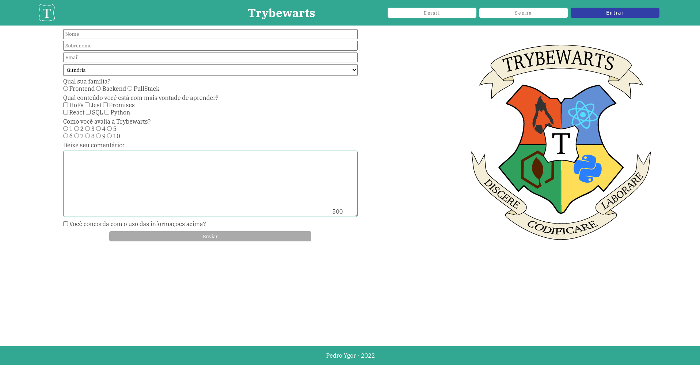

# Trybewarts

Criar um formulário de matrícula responsivo pra uma escola fictícia chamada Trybewarts.

## Stack utilizada

**Front-end:** HTML, CSS e javascript

## Instalação

```bash
# Clonar o projeto
$ git clone git@github.com:pedroygor/projetos-trybe.git

# Entre no diretório
# cd trybewarts

# Abra o arquivo index.html no navegador
```

## Screenshots



### Autores

- [@pedroygor](https://www.github.com/pedroygor)
- [@fernando](https://www.github.com/Fernando-Oli)
